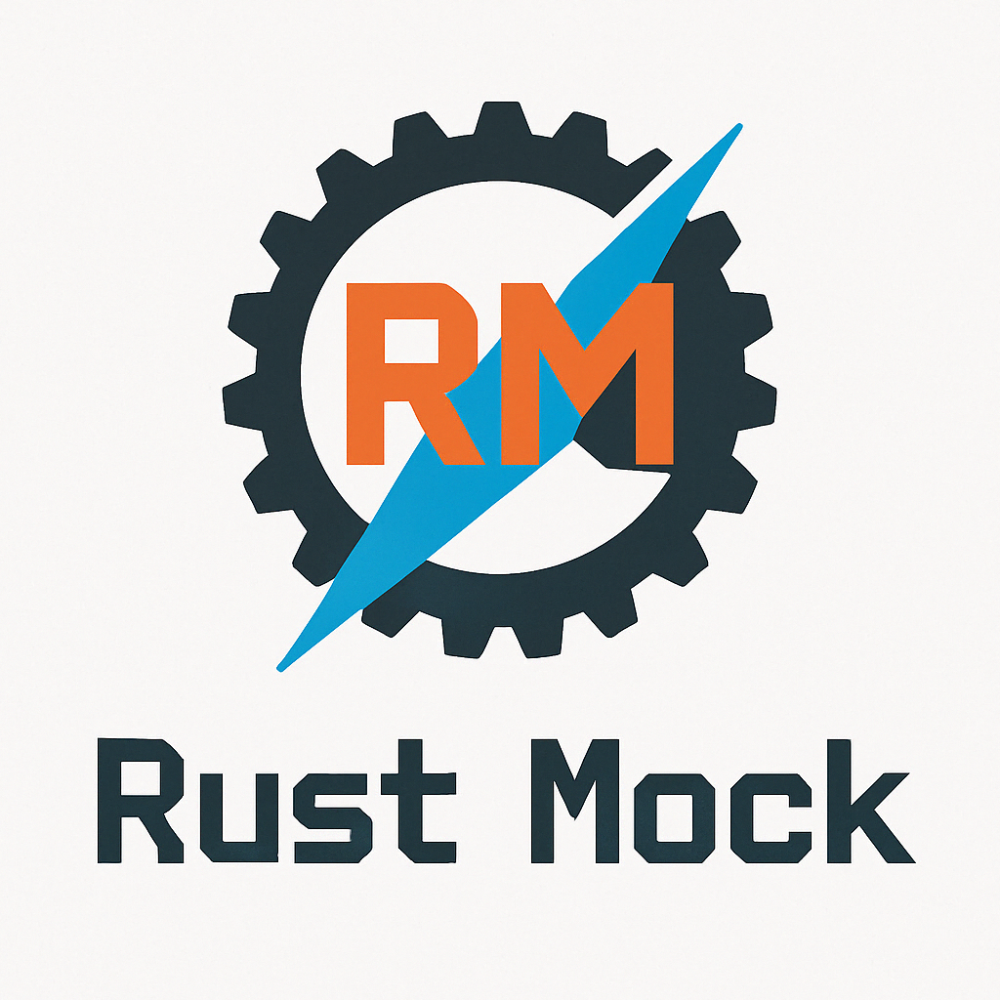
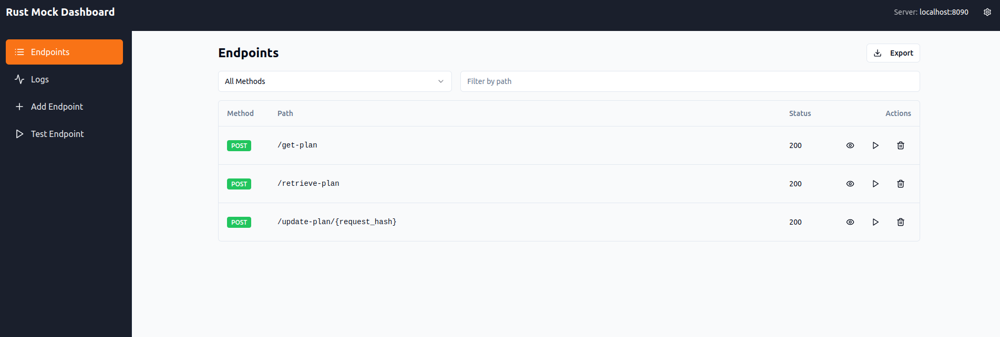
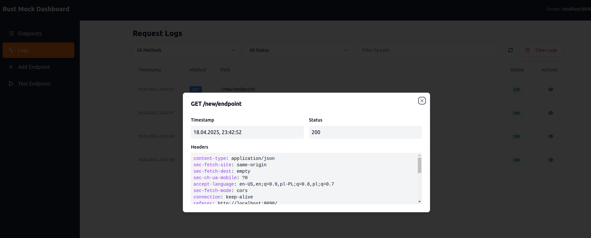
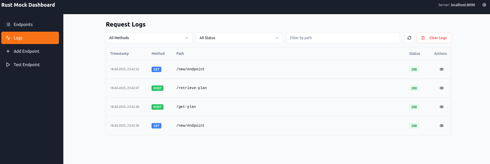
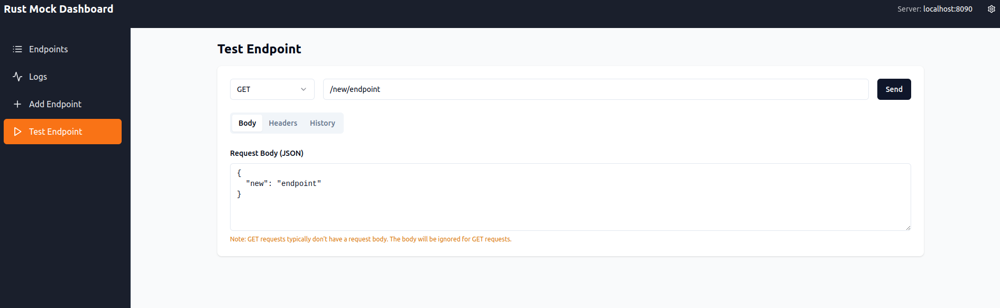

# RustMock

<p align="center">
  
</p>

<p align="center">
  <a href="https://github.com/arthurkowalsky/Rust-Mock/actions"></a>
  <a href="https://github.com/arthurkowalsky/Rust-Mock/releases"></a>
  <a href="https://github.com/arthurkowalsky/Rust-Mock/blob/main/LICENSE"></a>
  <a href="https://github.com/arthurkowalsky/Rust-Mock/pkgs/container/rust-mock"></a>
  <a href="https://github.com/arthurkowalsky/Rust-Mock/pkgs/container/rust-mock"></a>
</p>

> **⚡ Lightning-fast, lightweight API mock server built in Rust with a sleek React dashboard**

RustMock is an elegant, high-performance mock server designed for developers who need reliable, fast API mocks for development and testing. At just **~35MB** Docker image size, it's incredibly lightweight while providing powerful functionality.

## 🚀 Features

- **⚡ Blazing Fast Performance**: Built on Rust and Actix Web for exceptional speed
- **🎯 Dynamic API Mocking**: Create and configure mock endpoints on-the-fly
- **💻 Beautiful UI Dashboard**: Sleek React interface for managing all aspects of your mock server
- **🔍 Comprehensive Request Logging**: Monitor and inspect all incoming requests
- **📝 OpenAPI Support**: Automatically create mock endpoints from your OpenAPI spec
- **📥 OpenAPI Import/Export**: Import endpoints from OpenAPI specifications and export your configuration to OpenAPI 3.0 format
- **🧪 Built-in API Testing**: Test your endpoints directly from the dashboard
- **🐳 Docker Ready**: Get started in seconds with pre-built Docker images

## 📸 Screenshots

<table>
  <tr>
    <td></td>
    <td></td>
  </tr>
  <tr>
    <td></td>
    <td></td>
  </tr>
</table>

## 🔧 Quick Start

### Using Docker (Recommended)

```bash
# Basic run command
docker run -p 8090:8090 ghcr.io/arthurkowalsky/rust-mock:latest

# Run with OpenAPI specification from current directory
docker run -p 8090:8090 \
  -v $(pwd)/openapi.json:/app/openapi.json \
  -e OPENAPI_FILE=/app/openapi.json \
  ghcr.io/arthurkowalsky/rust-mock:latest

# Run with OpenAPI specification from specific directory (change /path/to as needed)
docker run -p 8090:8090 \
  -v /path/to/openapi.json:/app/openapi.json \
  -e OPENAPI_FILE=/app/openapi.json \
  ghcr.io/arthurkowalsky/rust-mock:latest
```

### Using Docker Compose

```yaml
version: '3'
services:
  rustmock:
    image: ghcr.io/arthurkowalsky/rust-mock:latest
    ports:
      - "8090:8090"
    volumes:
      - ./openapi.json:/app/openapi.json
    environment:
      - OPENAPI_FILE=/app/openapi.json
```

Then run:

```bash
docker-compose up -d
```

### Building from Source

```bash
git clone https://github.com/arthurkowalsky/Rust-Mock.git
cd Rust-Mock
cargo build --release
./target/release/RustMock
```

## 📖 Usage

### Accessing the Dashboard

Once running, access the dashboard at:
```
http://localhost:8090
```

### Configuration Options

RustMock comes pre-configured with sensible defaults (host: 0.0.0.0, port: 8090), but you can customize these settings when running the binary:

```bash
./RustMock --host 127.0.0.1 --port 3000
```

### Environment Variables

- `OPENAPI_FILE`: Path to your OpenAPI specification file (optional)

## 📡 API Reference

RustMock provides several admin endpoints to configure the mock server:

| Endpoint | Method | Description |
|----------|--------|-------------|
| `/__mock/config` | GET | Get current configuration |
| `/__mock/endpoints` | POST | Add a new endpoint |
| `/__mock/endpoints` | DELETE | Remove an endpoint |
| `/__mock/logs` | GET | Get request logs |
| `/__mock/logs` | DELETE | Clear logs |
| `/__mock/import` | POST | Import endpoints from OpenAPI specification |
| `/__mock/export` | GET | Export endpoints as OpenAPI 3.0 specification |

### Adding a Mock Endpoint

```http
POST /__mock/endpoints
Content-Type: application/json

{
  "method": "POST",
  "path": "/api/users",
  "response": {
    "id": 1,
    "name": "John Doe",
    "email": "john@example.com"
  },
  "status": 201,
  "headers": {
    "Content-Type": "application/json",
    "X-Custom-Header": "custom-value"
  }
}
```

### Importing from OpenAPI Specification

Import endpoints from an OpenAPI 3.0 specification file:

```http
POST /__mock/import
Content-Type: application/json

{
  "openapi_spec": {
    "openapi": "3.0.0",
    "info": {
      "title": "My API",
      "version": "1.0.0"
    },
    "paths": {
      "/api/users": {
        "get": {
          "summary": "Get users",
          "responses": {
            "200": {
              "description": "Success",
              "content": {
                "application/json": {
                  "example": [{"id": 1, "name": "John"}]
                }
              }
            }
          }
        }
      }
    }
  }
}
```

**Response:**
```json
{
  "imported": true,
  "count": 1,
  "endpoints": [
    {
      "method": "GET",
      "path": "/api/users",
      "status": 200
    }
  ]
}
```

### Exporting to OpenAPI Specification

Export all configured endpoints as an OpenAPI 3.0 specification:

```http
GET /__mock/export
```

**Response:**
```json
{
  "openapi": "3.0.0",
  "info": {
    "title": "Mock API",
    "description": "Exported from Rust-Mock server",
    "version": "1.0.0"
  },
  "paths": {
    "/api/users": {
      "get": {
        "summary": "GET /api/users",
        "operationId": "get_api_users",
        "responses": {
          "200": {
            "description": "Successful response with status 200",
            "content": {
              "application/json": {
                "example": [{"id": 1, "name": "John"}],
                "schema": {
                  "type": "object"
                }
              }
            }
          }
        }
      }
    }
  }
}
```

### Using the Dashboard for Import/Export

The React dashboard provides intuitive buttons for importing and exporting OpenAPI specifications:

1. **Import OpenAPI**: Click the "Import OpenAPI" button and select your OpenAPI JSON file
2. **Export OpenAPI**: Click the "Export OpenAPI" button to download your endpoints as an OpenAPI 3.0 specification
3. **Export JSON**: Click the "Export JSON" button to download endpoints in the internal format

## 🏗️ Architecture

RustMock consists of two main components:

1. **Backend Server**: Written in Rust using Actix Web, providing exceptional performance and reliability
2. **Frontend Dashboard**: Built with React and modern UI components for an intuitive experience

The server supports dynamic endpoint creation, request validation against OpenAPI schemas, and comprehensive request logging.

## 💡 Why RustMock?

- **Performance**: Built on Rust's blazing-fast performance
- **Resource Efficiency**: Only ~35MB Docker image and minimal memory footprint
- **Developer Experience**: Intuitive UI for managing all aspects of your mock server
- **Integration**: Works seamlessly with your existing development workflow
- **No Dependencies**: Self-contained binary with everything you need

## 🤝 Contributing

Contributions are welcome! Please feel free to submit a Pull Request.

1. Fork the repository
2. Create your feature branch (`git checkout -b feature/amazing-feature`)
3. Commit your changes (`git commit -m 'Add some amazing feature'`)
4. Push to the branch (`git push origin feature/amazing-feature`)
5. Open a Pull Request

## 📄 License

This project is licensed under the MIT License - see the [LICENSE](LICENSE) file for details.